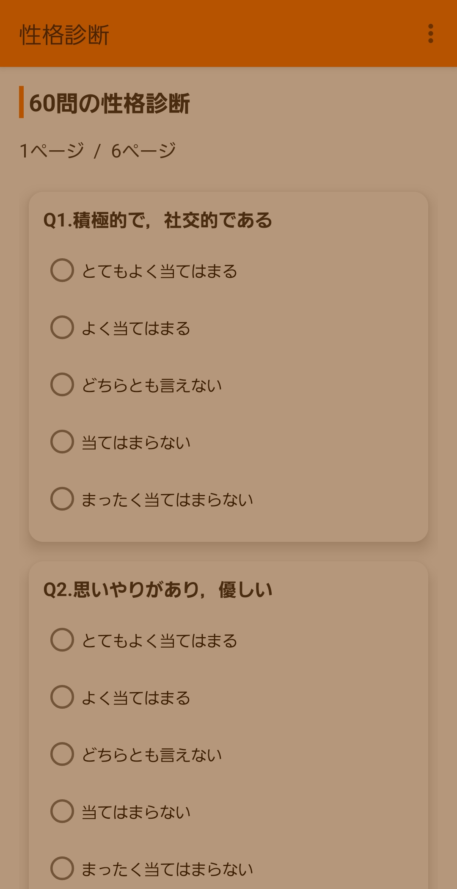
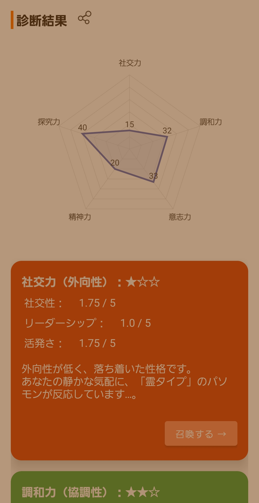
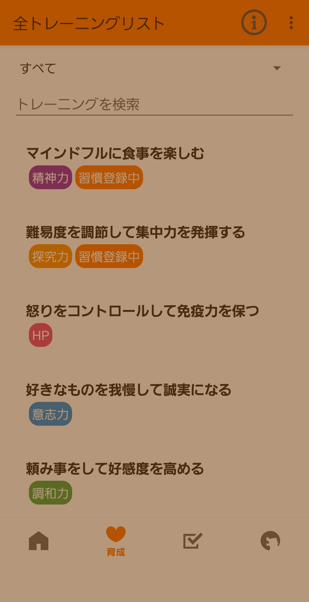
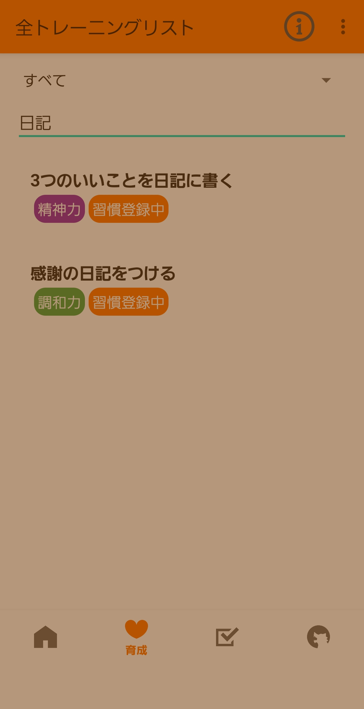
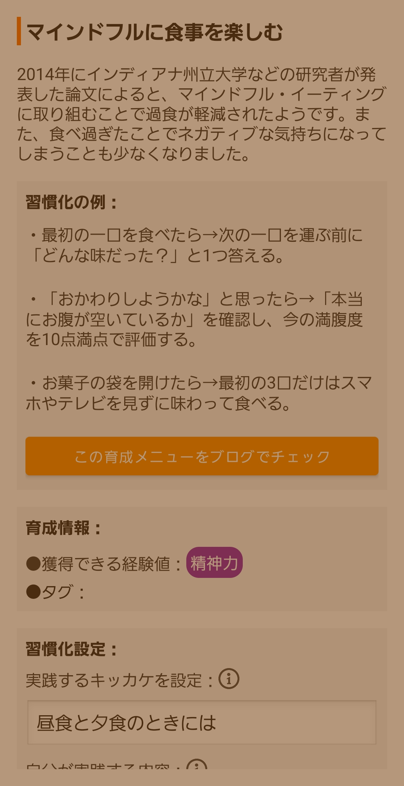
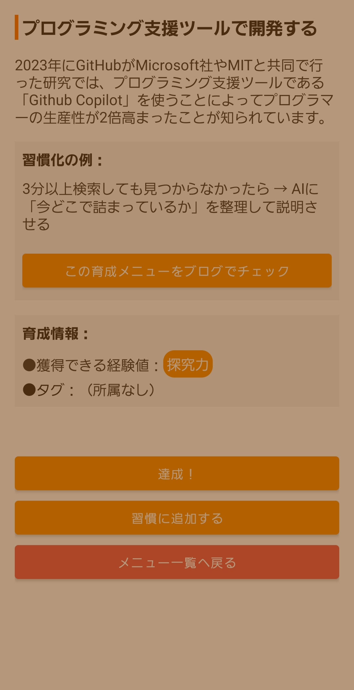
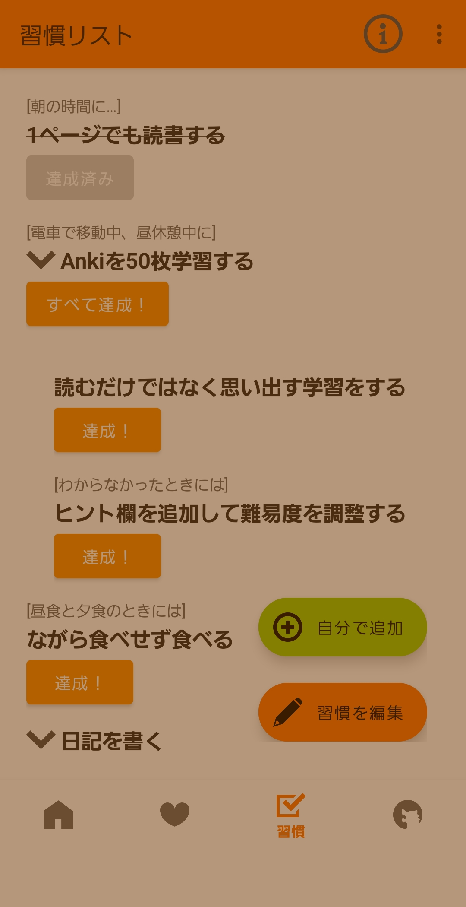

# Personal Monster

## アプリ概要

本アプリは、ゲーミフィケーションを取り入れた性格診断・習慣化支援のAndroidアプリです。

KotlinとFirebaseを使用し、ユーザー認証、性格診断、診断結果の保存、ライフハックの実践・習慣管理などを実装しています。

## コンセプト

性格診断の結果をモンスターとして表現します。

診断だけでなく、性格スキルを伸ばすためのライフハックを連載し、ユーザーが日々の習慣としてゲーム感覚で継続できることを目指しています。

## 制作目的

Androidアプリの個人開発を通して、アプリ開発に必要となる汎用的な技術の実装経験を得ることを目的として制作しました。

具体的には、以下のような技術の実装に取り組みました。

- 画面設計
- ユーザー操作に応じた状態管理
- 条件分岐
- データ保存・更新・削除
- 非同期処理
- リストの表示・検索・絞り込み
- リストの並べ替え
- データベース設計
- 外部ライブラリの導入・活用
- Firebaseとの連携

## 主な機能

- **ユーザー認証**
  - メールアドレスログイン
  - ゲストログイン
  - Googleアカウントログイン

- **性格診断**
  - 60問の性格診断
  - 診断結果の判定・表示
  - レーダーチャートによる診断結果の可視化

- **ライフハック一覧**
  - RecyclerViewによる一覧表示
  - カテゴリによる絞り込み
  - キーワード検索

- **ライフハック実践・習慣管理**
  - 達成状態の管理
  - 削除
  - 並び替え
  - グループ管理

- **データ管理**
  - ユーザーごとのデータ保存・更新・削除

- **共有・外部連携**
  - 診断結果の画像共有
  - 外部URLへの遷移

- **アカウント管理**
  - アカウント削除
  - ユーザーデータ削除
  - アプリ内からのアップデート確認

## 使用技術

- **言語**：Kotlin
- **開発環境**：Android Studio
- **認証**：Firebase Authentication
- **データベース**：Firebase Cloud Firestore
- **バージョン管理**：Git / GitHub
- **アプリ公開**：Google Play

## 工夫した点

### データ構造の分離

Firestoreでは、アプリ全体で共通して使用するマスターデータと、ユーザーごとに保存するデータを分離しました。

マスターデータにはモンスター情報やライフハック情報などを保存し、ユーザーデータにはライフハックの達成状況、並び順、メモなど、ユーザーごとに異なる情報を保存しています。

これにより、ユーザーごとのデータと共通データを分離し、データ管理・保守を行いやすい構成にしました。

### マスターデータによるコンテンツ管理

ライフハックコンテンツをアプリのソースコードに直接記述するのではなく、Firestoreのマスターデータとして管理しました。

そのため、既存のデータ構造に対応する範囲であれば、アプリ本体を更新せずに新しいコンテンツを追加できる構成としています。

### Firebase CLIを利用したデータの一括登録

FirestoreのマスターデータをJSONファイルで管理し、Firebase CLIをコマンドラインから操作してFirestoreへ一括登録できるようにしました。

大量のモンスター情報やライフハック情報を手作業で登録する必要をなくし、データ追加・更新の効率化を図りました。

### 外部ライブラリを利用したUI実装

標準UIコンポーネントだけでは実現しにくい表現について、外部ライブラリを導入しました。

レーダーチャートやカード形式のUIなどを実装し、診断結果やモンスター情報を視覚的に表示しました。

## 苦労した点・解決したこと

### クローズドテスト

Google Play公開前に12名の協力者による14日間のクローズドテストを実施しました。

実際の利用者から操作性や不具合についてフィードバックを収集し、アプリの改善に反映しました。

### 端末ごとのUI調整

アプリの画面がステータスバーに潜り込んでしまう問題を指摘していただきました。

端末ごとのステータスバーを考慮して画面表示を調整する処理を実装し、問題を解決しました。

### Firebaseへの非同期処理への対応

Firebaseへの非同期処理中にユーザーがボタンを連続タップすると、同じ処理が複数回実行される可能性がありました。

そこで、処理開始時にボタンを無効化し、処理完了後に再度有効化することで、連続操作による重複処理を防止しました。

## 制作期間

2025年11月～2026年6月（Google Playリリース）

## 担当範囲

企画・設計・UIデザイン・実装・テスト・公開まで、個人で開発しました。

## スクリーンショット

### 性格診断

### 診断結果

### ライフハック一覧

### ライフハック検索

### ライフハック詳細

### 習慣・Todo管理

## 公開情報

Google Playで公開しています。

[Google Play：Personal Monster](https://play.google.com/store/apps/details?id=com.dino.personalmonster)

## 今後の改善予定

- ライフハックの達成状況をカレンダーで表示する機能
- 習慣を一定数達成した際のリワード機能
  - 新しいモンスターの獲得
  - 称号の獲得
